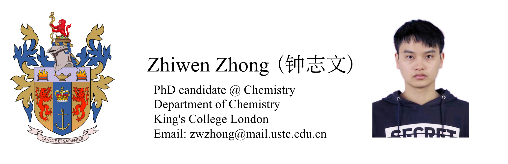

### **Biography** 
------------
I am currently a first year phD candidate student in the Department of Chemistry, King's College London (KCL), supervised by Dr Argyris Politis and Pfro 
Ismael Diez Perez. Before that, I have received a Master degree in Biochemistry and Molecular Biology at University of Science and Technology of China (USTC), which my tutor was Prof Chao Wang. And I also have a Bachelor degree in Biotechnology at Anhui University, under the supervision of Prof Bei Huang.

### **Research Interest** 

I am interested in developing and applying computational and experimental methods to study the structure and function of protein assemblies. Specifically, they aim to:

a) develop hybrid structural biology methods to predict the structure of large protein complexes,

b) perform mass spectrometry based experiments to generate structural restraints for capturing the flexibility and assembly pathways of transient complexes,

c) use the structural predictions to develop testable hypotheses for annotating the functions of biologically important proteins such as membrane embedded proteins and those involved in cell cycle.

### **Publications** (* indicates co-first auther)
------------
Yanshen Zhang, **Zhiwen Zhong*** , Jin Ye and Chao Wang. Crystal structure of the PDZ4 domain of MAGI2 in complex with PBM of ARMS reveals a canonical PDZ recognition mode
Author links open overlay panel. ***Neurochemistry International*** https://doi.org/10.1016/j.neuint.2021.105152

Xiang Fu, **Zhiwen Zhong***, Feng Hu, Yi Zhang, Chunxia Li, Peng Yan, Lixue Feng, Jinglian Shen, Bei Huang, The protective effects of selenium-enriched Spirulina Platensis on chronic alcohol-induced liver injury in mice. ***Food & function*** 2018 DOI: 10.1039/c8fo00477c https://pubs.rsc.org/en/content/articlelanding/2018/FO/C8FO00477C#!divRelatedContent&articles

### **Reseach Experiences** 
------------
**[10/2020] Crystal Structure of MAGI2-PDZ4/ARMS-PBM Complex**

**[07/2019] Crystal Structure of HCFC2 Fn3 Domain**

**[01/2019] TRIM46 and HCFC2 Co-localized in the AIS with Ankyrin-G in Hippocampus**

**[04/2018] Use Yeast Two-hybrid to Screen Protein that Can Bind with TRIM46**

**[06/2017] The Protective Effects of Selenium-Enriched Spirulina Platensis on Chronic Alcohol-Induced Liver Injury in Mice**

### **Selected Honors and Awards**
------------
[9/2019] Academic Scholarship, University of science and technology of China

[9/2018] Academic Scholarship, University of science and technology of China

[9/2017] Academic Scholarship, University of science and technology of China 

[12/2015] Outstanding scholarship of Anhui University

### **Coursera Certificates**
------------
[09/01/2019] Python Data Structures

[07/15/2019] Applied Machine Learning in Python

[07/09/2019] Structuring Machine Learning Projects

[06/10/2019] Neural Networks and Deep Learning

### **Extracurricular Activities**
------------
[11/2015] **Leader**, Hefei Botanical Garden Nameplate Activity

[11/2015] **Project Leader**, Anhui Province Entrepreneurship Simulation Training

[07/2015] **Minister**, the publicity department of Baidu Encyclopedia Club, Anhui University

------------

*Last updated by Zhiwen Zhong on Sep 2, 2021

