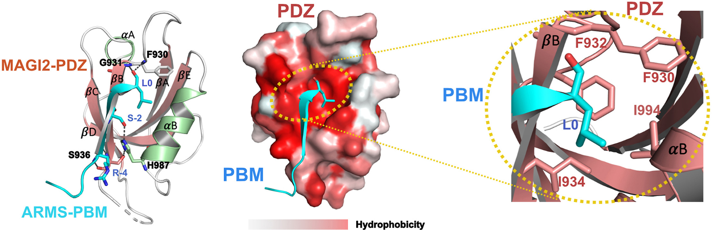
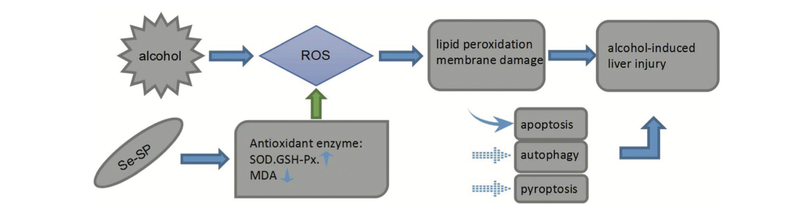

### **Biography** 
------------
I am currently a second year PhD student in the Department of Chemistry/Physics, King's College London (KCL), supervised by Prof. Chris Lorenz and Pfro. Martin Ulmschneider. Before that, I have received a Master degree in Biochemistry and Molecular Biology at University of Science and Technology of China (USTC). 

### **Research Interest** 

I am currently focused on constructing intricate protein-protein interaction models at the atomic level using molecular dynamics simulations. This approach will help clarify the molecular mechanisms that underpin protein complex formation, resulting in a thorough comprehension of these significant biological processes. Additionally, the models I create are expected to have valuable implications for drug discovery.

### **Publications** (* indicates co-first auther)
------------
Yanshen Zhang, **Zhiwen Zhong*** , Jin Ye and Chao Wang. Crystal structure of the PDZ4 domain of MAGI2 in complex with PBM of ARMS reveals a canonical PDZ recognition mode ***Neurochemistry International*** 2021

Xiang Fu, **Zhiwen Zhong*** , Feng Hu, Yi Zhang, Chunxia Li, Peng Yan, Lixue Feng, Jinglian Shen, Bei Huang, The protective effects of selenium-enriched Spirulina Platensis on chronic alcohol-induced liver injury in mice. ***Food & function*** 2018

### **Abilities & Skills** 
------------
Software/Packages: Gromacs, MDAnalysis, PyMOL, SPSS, GraphPad Prism 5, VMD, PLGS, DynamX 

Experimental Skills: X-Ray Crystallography, Protein Purification, Cell Line Culture, HDX-MS

### **Reseach Experiences** 
------------
[04/2022] Atomic Detailed Understanding of TREM2 and DAP12 Transmembrane Domain Gives Insights toAlzheimer’s Disease Drug Discovery

[10/2021] Dynamics Changes of XylE using HDX-MS

[10/2020] Crystal Structure of MAGI2-PDZ4/ARMS-PBM Complex

[07/2019] Crystal Structure of HCFC2 Fn3 Domain

[01/2019] TRIM46 and HCFC2 Co-localized in the AIS with Ankyrin-G in Hippocampus

[04/2018] Use Yeast Two-hybrid to Screen Protein that Can Bind with TRIM46

[06/2017] The Protective Effects of Selenium-Enriched Spirulina Platensis on Chronic Alcohol-Induced Liver Injury in Mice

### **Selected Honors and Awards**
------------

[2021-2025] King’s College London - China Scholarship Council (4 years)

[2017-2020] Academic Scholarship, University of Science and Technology of China (3 years)

[2014-2015] Outstanding Scholarship of Anhui University

### **Coursera Certificates**
------------
[09/01/2019] Python Data Structures

[07/15/2019] Applied Machine Learning in Python

[07/09/2019] Structuring Machine Learning Projects

[06/10/2019] Neural Networks and Deep Learning

### **Extracurricular Activities**
------------
[04/2021-07/2021] **Researcher**, Hankebio Drug Discovery Company Internship, Hefei

[2014-2017] **Project Leader**, National Training Program of Innovation and Entrepreneurship for Undergraduates, Anhui Province

[2014-2015] **Minister**, Baidu Encyclopedia Club, Anhui University

------------

*Last updated by Zhiwen Zhong on April 4, 2023

