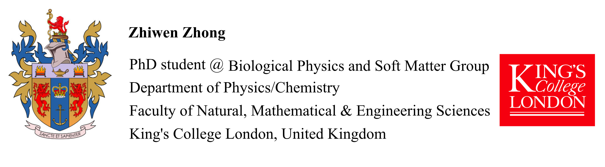
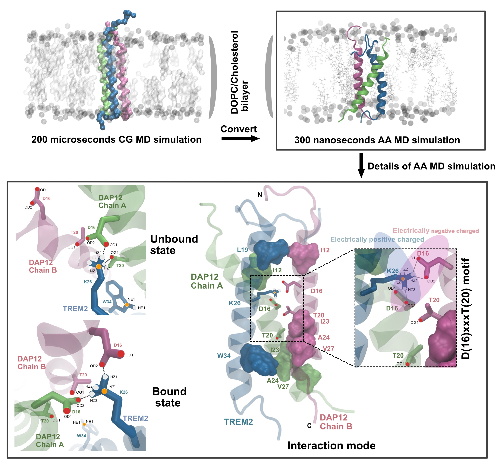

### **Biography** 
------------
I am a final-year PhD student in the Department of Physics and Department of Chemistry at King’s College London, under the supervision of Prof. Chris Lorenz and Prof. Martin Ulmschneider. Prior to this, I earned a Master’s degree in Biochemistry and Molecular Biology from the University of Science and Technology of China (USTC).

### **Research Interest** 
------------
I am broadly interested in the computational study of protein structure, dynamics, and function, particularly using molecular dynamics (MD) simulations, machine learning, and structural bioinformatics. I am excited about contributing to interdisciplinary projects that combine atomistic simulations with machine learning to address challenges in biocatalysis, pharmaceutical design, and functional annotation.

### **Publications** (* indicates co-first auther)
------------

Zhiwen Zhong, Martin B. Ulmschneider, and Christian D. Lorenz. Unraveling the Molecular Dance: Insights into TREM2/DAP12 Complex Formation in Alzheimer’s Disease through Molecular Dynamics ***ACS OMEGA*** 2024 [DOI:10.1021](https://pubs.acs.org/doi/10.1021/acsomega.4c03060)

Yanshen Zhang, **Zhiwen Zhong*** , Jin Ye and Chao Wang. Crystal structure of the PDZ4 domain of MAGI2 in complex with PBM of ARMS reveals a canonical PDZ recognition mode ***Neurochemistry International*** 2021 [DOI:10.1016](https://www.sciencedirect.com/science/article/abs/pii/S0197018621001984)

Xiang Fu, **Zhiwen Zhong*** , Feng Hu, Yi Zhang, Chunxia Li, Peng Yan, Lixue Feng, Jinglian Shen, Bei Huang. The protective effects of selenium-enriched Spirulina Platensis on chronic alcohol-induced liver injury in mice. ***Food & function*** 2018 [DOI](https://pubs.rsc.org/en/content/articlelanding/2018/fo/c8fo00477c/unauth)

### **Abilities & Skills** 
------------
Software/Packages: Gromacs, MDAnalysis, PyMOL, SPSS, VMD, PLGS, DynamX, Matplotlib, Pandas 

Experimental Skills: X-ray Crystallography, Protein Purification, Cell Line Culture, Confocal Microscopy, Hydrogen-Deuterium Exchange Mass Spectrometry

### **Reseach Experiences** 
------------
[04/2022] Atomic Detailed Understanding of TREM2 and DAP12 Transmembrane Domain Gives Insights to Alzheimer's Disease Drug Discovery

[10/2021] Dynamics Changes of XylE using HDX-MS

[10/2020] Crystal Structure of MAGI2-PDZ4/ARMS-PBM Complex

[07/2019] Crystal Structure of HCFC2 Fn3 Domain

[01/2019] TRIM46 and HCFC2 Co-localized in the AIS with Ankyrin-G in Hippocampus

[04/2018] Use Yeast Two-hybrid to Screen Protein that Can Bind with TRIM46

[06/2017] The Protective Effects of Selenium-Enriched Spirulina Platensis on Chronic Alcohol-Induced Liver Injury in Mice

### **Selected Honors and Awards**
------------

[2021-2025] King’s College London - China Scholarship Council (4 years)

[2017-2020] Academic Scholarship, University of Science and Technology of China (3 years)

[2014-2015] Outstanding Scholarship of Anhui University

### **Coursera Certificates**
------------
[09/01/2019] Python Data Structures

[07/15/2019] Applied Machine Learning in Python

[07/09/2019] Structuring Machine Learning Projects

[06/10/2019] Neural Networks and Deep Learning

### **Extracurricular Activities**
------------
[04/2021-07/2021] **Researcher**, Hankebio Drug Discovery Company Internship, Hefei

[2014-2017] **Project Leader**, National Training Program of Innovation and Entrepreneurship for Undergraduates, Anhui Province

[2014-2015] **Minister**, Baidu Encyclopedia Club, Anhui University

------------

*Last updated by Zhiwen Zhong on 30 Sep, 2024

