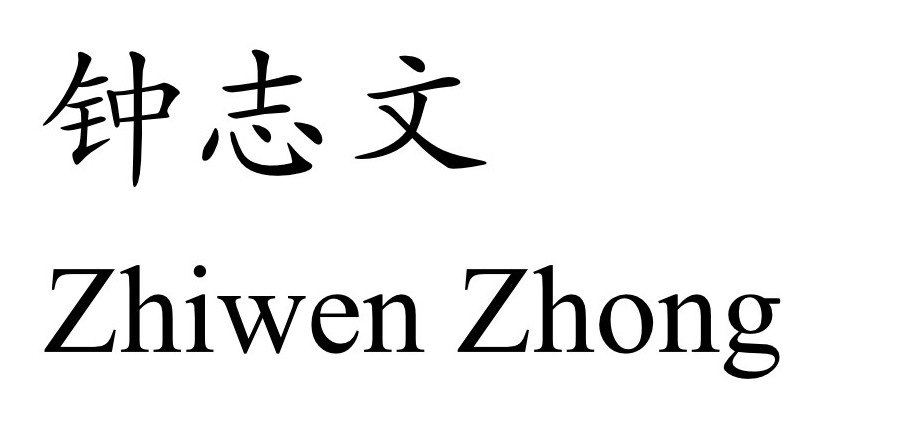
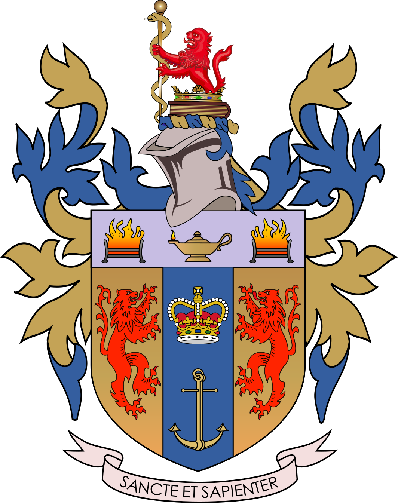
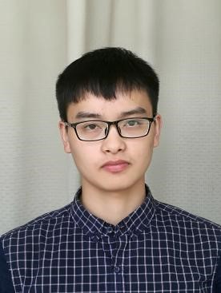

|    |   PhD candidate @ [Chemistry](https://www.kcl.ac.uk/chemistry) Department of Chemistry [King's College London](https://www.kcl.ac.uk/),  Email: zwzhong@mail.ustc.edu.cn | |
| ----------------------------------------------------------- | ------------------------------------------------------------ | ------------------------------------------------------------ |

Site Directory: [[Biography\]](https://ogshun.github.io/#sec: Biography) [[Research Interest\]](https://ogshun.github.io/#sec: Research Interest) [[Publications\]](https://ogshun.github.io/#sec: Publications) [[Academia Services\]](https://ogshun.github.io/#sec: Academia Services)[[Teaching Assistant\]](https://ogshun.github.io/#sec: Teaching Assistant) [[Awards & Honors\]](https://ogshun.github.io/#sec: Selected Honors) [[Personal Interests\]](https://ogshun.github.io/#sec: Personal Interests)

# Biography

I am a PhD candidate at School of Computer Science and Engineering, the University of New South Wales, supervised by [Prof. Lina Yao](https://www.linayao.com/) and [Prof. Boualem Benatallah](https://sites.google.com/site/boualembenatallahwebsite/). Before that, I received my M.S. and B.S. degree from the Department of Computer Science and Engineering, Nanjing University, in 2019 and 2016, respectively.
You may see my latest CV [here](https://ogshun.github.io/files/cv_yunli.pdf) (2021-04 edition).
[[go top\]](https://ogshun.github.io/#title)

# Research Interest

My research interests mainly focus on deep learning and big data analytics, especially on the applications in human healthcare. My current topics are summarized as follows:

- Zero-shot learning
- Genome analytics
- Medical Imaging

[[go top\]](https://ogshun.github.io/#title)

# Publications (* indicates co-first auther)

- Zhe Liu, **Yun Li**, Lina Yao, Xianzhi Wang, and Feiping Nie. " "Agglomerative Neural Networks for Multi-view Clustering "[J], *TNNLS*, 2021.
- Zhe Liu, **Yun Li\***, Lina Yao, Xianzhi Wang, and Guodong Long. " "Task Aligned Generative Meta-learning for Zero-shot Learning "[C], *AAAI*, 2021.
- **Yun Li**, Zhe Liu, Lina Yao, Zihuai He. " Non-local Self-attentive Autoencoder for Genetic Functionality Prediction "[C], *CIKM*, 2020.
- **Yun Li**, Yixiang Fang, Reynold Cheng, Wenjie Zhang. " Spatial pattern matching: A new direction for finding spatial objects "[J], SIGSPATIAL Special, 2019, 11(1): 3-12. （invited paper）
- Yixiang Fang, **Yun Li**, Reynold Cheng, Nikos Mamoulis, Gao Cong. " Evaluating Pattern Matching Queries for Spatial Databases "[J], The VLDB Journal, 2019, 28(5): 649-673
- Yixiang Fang, Reynold Cheng, Gao Cong, Nikos Mamoulis, **Yun Li**. " On Spatial Pattern Matching "[C], *ICDE*, 2018. [[online demo\]](http://cexplorer.cs.hku.hk:8080/SpaceKey/index.jsp)
- Hengyang Lu, **Yun Li**, Chi Tang, Chongjun Wang and Junyuan Xie. " Constructing Pseudo Documents with Semantic Similarity for Short Text Topic Discovery "[C], *ICONIP*, 2018.
- Hengyang Lu, Gaojian Ge, **Yun Li**, Chongjun Wang and Junyuan Xie. " Exploiting Global Semantic Similarity Biterms for Short-text Topic Discovery "[C], *ICTAI*, 2018.
- Hengyang Lu, Ning Kang, **Yun Li**, Qianyi Zhan, Junyuan Xie, Chongjun Wang. " Utilizing Recurrent Neural Network for Topic Discovery in Short Text Scenarios "[J], *Intelligent Data Analysis\*, 2019, 23(2): 259-277.
  **
- **Yankai Chen, Yixiang Fang, Reynold Cheng, and **Yun Li**, Xiaojun Chen, Jie Zhang. " Exploring Communities in Large Profiled Graphs "[J], \*TKDE\*, 2018.
  **

**[[go top\]](https://ogshun.github.io/#title)

Academia ServicesExternal reviewer, ACM MM 2021.
Reviewer, TOSN.
External reviewer, AAAI 2021.
External reviewer, CIKM 2020.
External reviewer, KDD 2020.
External reviewer, TKDE 2019.
[[go top\]](https://ogshun.github.io/#title)

Teaching Assistant\*Introduction to Java Programming\*, for undergraduate student. fall, 2016.
[[go top\]](https://ogshun.github.io/#title)

Awards & HonorsCIKM student travel grant. 2020Computer Science funded Top-ups Scholarships. 2020University International Postgraduate Award (UIPA). from 2019 to 2023First Prize of Academic Scholarships. 2017, 2016First Prize of Academic Scholarships. 2017, 2016Second Prize of People's Scholarship Award. 2015Outstanding Student, CST Dept. 2015, 2014Excellent League Member Award, NJU. 2014... ...[[go top\]](https://ogshun.github.io/#title)

Personal Interestsreadingboard role-playing games and card games[[go top\]](https://ogshun.github.io/#title)
**
 
 
 
 ***Click for:*** [**[CV]**](CV-ZZW20201119.pdf)

School of Life Sciences, Division of Life Sciences and Medicine

 

 
Ministry of Education Key Laboratory for Membrane-less Organelles & Cellular Dynamics

### **Zhiwen Zhong**   
------------
***Master Degree Candidate***

Ministry of Education Key Laboratory for Membrane-less Organelles & Cellular Dynamics

Hefei National Laboratory for Physical Sciences at the Microscale

School of Life Sciences, Division of Life Sciences and Medicine

University of Science and Technology of China, 230027 Hefei, P.R. China

**Tel: +86-13035064134**

**Email: zwzhong@mail.ustc.edu.cn**

### **Biography** 
------------
I am currently a final year (2019-2020) graduate student at the School of Life Sciences, University of Science and Technology of China(USTC), supervised by Prof. Chao Wang and Prof. Mingjie Zhang. Previously, I received a B.S. degree in Biotechnology from Anhui University in 2017, under the supervision of Prof. Bei Huang.

**An Immature Idea of Mine:** 

With a strong desire to upgrade my knowledge and skills, I am applying for the PhD programme in UK. I hope to use structural biology and bioinformatics to answer questions like neurodegenerative disorder or other genetic diseases, with the help of deep learning we are able to simulate protein-protein interactions and mutate binding sites to see how cells are affected. The traditional method knocks down a particular gene in mice to observe the phenotype. However, I feel that this method has room for improvement because knockdown mice may self-regulate themselves, thus possibly invalidating the research findings. The reason for this may be if one protein was knocked down, changes may happen via other routes, meaning that the difference may not be solely due to that one protein. To further explore this paradox, I hope to model this “Protein-Net” using computer simulations. By precisely controlling certain variables, we may draw a more solid conclusion of what roles of a particular protein play. 
 

### **Selected Publications** 
------------
Jin Ye, **Zhiwen Zhong** (Co-first author), Yanshen Zhang and Chao Wang. Crystal structure of MAGI2-PDZ4/ARMS-PBM complex reveals a canonical PDZ/PBM interaction. ***Journal of   Structural Biology*** (Under reviewing)

Xiang Fu, **Zhiwen Zhong** (Co-first author), Feng Hu, Yi Zhang, Chunxia Li, Peng Yan, Lixue Feng, Jinglian Shen, Bei Huang, The protective effects of selenium-enriched Spirulina Platensis on chronic alcohol-induced liver injury in mice. ***Food & function*** 2018 DOI: 10.1039/c8fo00477c

### **Coursera Certificates**
------------
[09/01/2019] Python Data Structures

[07/15/2019] Applied Machine Learning in Python

[07/09/2019] Structuring Machine Learning Projects

[06/10/2019] Neural Networks and Deep Learning

### **Reseach Experiences** 
------------
**[10/2020] Crystal Structure of MAGI2-PDZ4/ARMS-PBM Complex**

•	Membrane-associated guanylate kinase, WW and PDZ domain-containing protein 2 (MAGI2) is a scaffold protein that plays a critical role in synaptic junction by assembling neurotransmitter receptors and cell adhesion proteins

•	We characterized the binding between MAGI2 and ARMS (ankyrin repeat-rich membrane spanning) through multiple biochemical assays and solved the crystal structure of MAGI2/ARMS complex.

•	Our structure shows the binding interface lies between the canonical αB/βB groove from MAGI2-PDZ4 and the C-terminal PBM from ARMS

•	Structure analysis combining with mutagenesis studies revealed the molecular basis of MAGI2-PDZ4/ARMS-PBM complex formation, which remained highly similar to canonical PDZ/PBM interaction

**[07/2019] Crystal Structure of HCFC2 Fn3 Domain**

•	Innovatively identified the interaction between TRIM46 and HCFC2, and partial structural information about the protein HCFC2. Screened out of HCFC2 protein from the RNA library of mouse brain using yeast two-hybrid technology;

•	Designed truncation according to biochemical properties and constructed into a 32M3C vector to express the truncation protein in Escherichia Coli. Further purified by FPLC after preliminary purification in Ni-column and obtained protein sample by high-speed centrifugation;

•	Added high purity protein samples to Hampton's primary screening reagent to crystallize. Respectively made the protein solutions with a different gradient of salt concentration, pH, and protein concentration for optimizing the protein crystal;

•	Conducted crystal diffraction for protein crystal. Preliminarily process the diffraction data by HKL3000 and carried out molecular replacement through CCP4. Obtained the high resolution 1.8 Å HCFC2 FN3 domain structure with Phenix refine after COOT manual modification.

**[01/2019] TRIM46 and HCFC2 Co-localized in the AIS with Ankyrin-G in Hippocampus**

•	Carefully minimized contaminating cell types (i.e. astrocytes) from newborn C57 mice and cultured in Glibo CNB medium for four days;

•	Co-transfected Flag-TRIM46 and GFP-HCFC2 plasmids to hippocampus cells using calcium phosphate transfection and cultured for another three days;

•	Harvested the hippocampus cells on day 7. Observed in ZEISS LSM 710 confocal laser scanning microscope and found co-localization in AIS where ankyrin-G exists as a marker;

•	Co-localization also existed in HeLa cells. HCFC2 form fibres in cytoplasm overlapped with TRIM46 while only expressed in nuclear when transfected alone.

**[04/2018] Use Yeast Two-hybrid to Screen Protein that Can Bind with TRIM46**

•	Inserted TRIM46 gene into yeast vector pGBKT7 and grow in ampicillin plate to duplicate the plasmid;

•	Prepared competent cells of Y2H and transferred pGBKT7-TRIM46 to it using Yeastmaker Yeast Transformation System growing for a week;

•	Hybridized Y2H strain and Y187 strain from Takara's mouse brain library. Mixed protein X from mouse brain library and TRIM46 which expressed by hybrid generation. Activated reporter genes so that it was showing activation traits;

•	Isolated plasmid by using Clontech Easy Yeast Plasmid Isolation Kit. Obtained the plasmid of protein X excluding TRIM46 and detected 24 positive results from subsequent gene sequencing;

•	Verified their interaction by co-transferring pGBKT7-TRIM46 and pGADT7-HCFC2 to Y187 strain and found it can activate reporter genes;

•	Detected that TRIM46 overlapped with HCFC2 via immunofluorescence co-localization in HeLa cells.

**[06/2017]  The Protective Effects of Selenium-Enriched Spirulina Platensis on Chronic Alcohol-Induced Liver Injury in Mice**

•	Used Zarrouk medium to shake table culture under conditions of 20-22 ℃, pH 9, the light intensity of 3000 ~ 4000 Lx, and light intensity of 14 hours per day. Respectively added sodium selenite to make the final concentration of culture solution reach 450 mg/L on the 7th, 8th and 9th day of culture;

•	Raised KM mice in an environment of 25±2℃, free diet, 12 h cycle of light every day, and randomly divided into 2 groups (the control group and the alcohol group) with 60 animals in each group after one week of adaptive feeding;

•	Gavaged the control group with distilled water and the alcohol group with alcohol for 6 weeks to establish a model of chronic alcoholic liver injury. Detected the content of alanine aminotransferase (ALT), aspartate aminotransferase (AST), total cholesterol (TC), Triglyceride (TG) of two groups; 

•	Divided 60 mice from the alcohol group into six groups, each containing 10 mice as follows: the model group; the control group; and the low-, middle-, high-dose Se-SP and SP groups. Treated mice in the four test groups with daily doses of 100, 200, and 400 mg per kg bodyweight of Se-SP and 200 mg per kg bodyweight of SP respectively, for 42 consecutive days;

•	Treated mice in the normal and model groups with saline. Detected the content decrease of ALT, AST, TC, TG content compared with the alcohol group;

•	Made and observed liver tissue slices under an optical microscope. Found that liver cells in the group with different concentrations of Se-enriched spirulina were healthier than those in the alcohol group, and the repair effect of Se-enriched spirulina in medium concentration was the best；

•	Conducted immunohistochemical experiment to explore the mechanism of repairing the chronic liver injury in mice and found that the repair of chronic alcoholic liver injury by Se-enriched spirulina was mainly conducted by apoptosis, supplemented by autophagy.

### **Selected Honors and Awards**
------------
[9/2019] Academic Scholarship, University of science and technology of China

[9/2018] Academic Scholarship, University of science and technology of China

[9/2017] Academic Scholarship, University of science and technology of China 

[12/2015] Outstanding scholarship of Anhui University

### **Extracurricular Activities**
------------
[11/2015] **Leader**, Hefei Botanical Garden Nameplate Activity

[11/2015] **Project Leader**, Anhui Province Entrepreneurship Simulation Training

[07/2015] **Minister**, the publicity department of Baidu Encyclopedia Club, Anhui University

------------

*Last updated by Zhiwen Zhong on **Nov 19, 2020***

